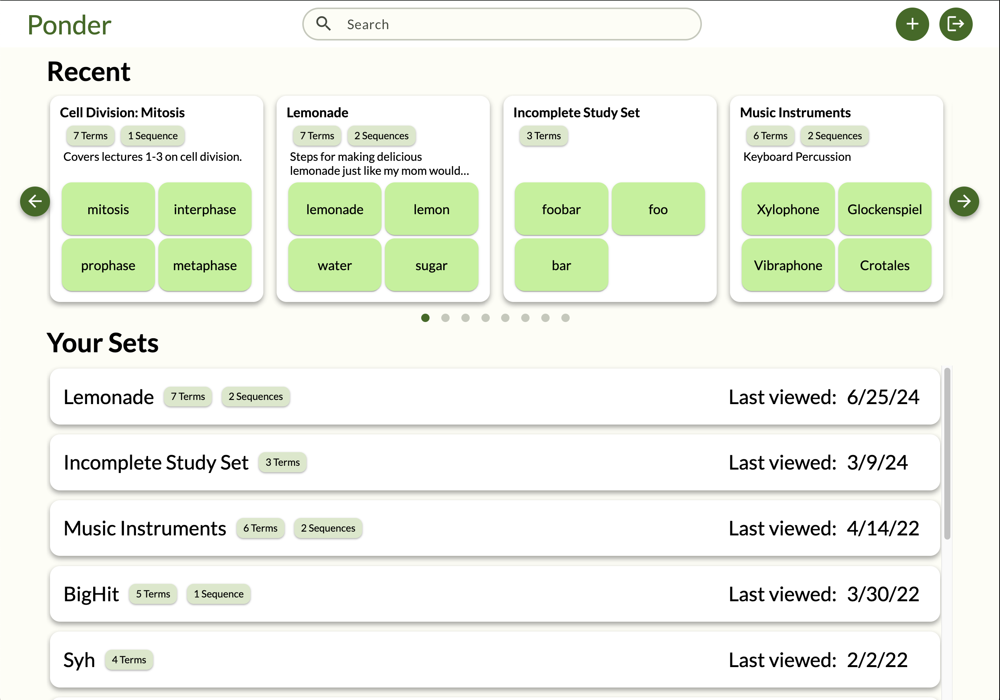
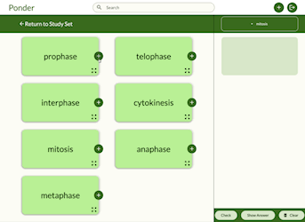

## Hi Y'all 👋
I am Ashley Jones, a computer science researcher. My preferred pronouns are she/her.

## Some Things I've Use

  
  
  
  
  
  
  
  
  
  
  
  
  
  

..but I am down to learn more. 

## Do I have a preferred programming language?
No, I think all major languages are fine. However, I refuse to start any new project in JS because TypeScripts is superior (I like rules!!!). I'll maintain and work on existing JS projects if asked nicely, though 😸

I also don't really care which framework I use. Learning is fun, and I am capable of reading the documentation.

## Some Projects I've Worked On
**Optimizing Safety in Aviation** (Current)
- Work with a group of graduate and undergraduate researchers in the [D2 Lab](https://home.csulb.edu/~bfu/lab.html) at CSULB on a Boeing contracted research project that investigates the use of eye-trackers in airplane cockpits.
- Analyze gaze characteristics (ex. fixation duration, saccade velocity, convex hull) using traditional statistical analysis and machine learning.
- Checkout some of the code [here](https://github.com/TheD2Lab).

**Ponder Study App** (Senior Design Project)
- We made a [flashcard study web app](https://github.com/PonderTeam/ponder-app) that allows the user to also create "linked lists" of cards (we called them sequences) that allow users to study the relationship between cards.
- Yes, we also did users interviews, market studies, Figma designs, SCRUM, and all that other design process stuff. I am especially proud of the my [product backlog](https://github.com/orgs/PonderTeam/projects/1/views/1). My team can proudly boast that we never broke our main branch due to our use of Github issues and code reviews (No other team in our section could say the same 🤣). 

**Computer Base Testing**
- Created online tests for programming students using [PrairieLearn](https://www.prairielearn.com/) as part of a joint research project with UC Berkeley and El Camino College.
- Sadly, you can't see my code because FERPA.

<!--
**ashkjones/ashkjones** is a ✨ _special_ ✨ repository because its `README.md` (this file) appears on your GitHub profile.

Here are some ideas to get you started:

- 🔭 I’m currently working on ...
- 🌱 I’m currently learning ...
- 👯 I’m looking to collaborate on ...
- 🤔 I’m looking for help with ...
- 💬 Ask me about ...
- 📫 How to reach me: ...
- 😄 Pronouns: ...
- ⚡ Fun fact: ...
-->
